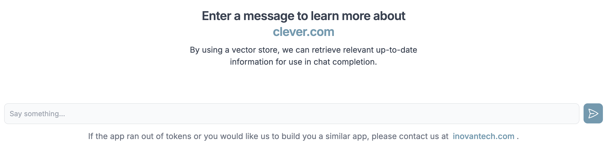

# AI Chatbot with LanceDB Integration - Website Context Retrieval

## About

This repository hosts a Next.js application that enables the use of an AI chatbot to retrieve context from websites. The website data is stored on-premises using the LanceDB vector store, which is lightweight and can be easily embedded into Next.js applications. The app allows for the processing of multiple links by submitting a website sitemap.xml or a direct URL.


Once the data has been loaded and stored into the vector database, you'll be able to chat with data from the website:



And you can ask questions that pertain to the content of the website page(s) you have just processed:


## How it works

- **Context-Aware Conversations**: The chatbot uses LanceDB to store and retrieve vector embeddings of website content, enabling it to provide context-aware responses based on the submitted website.
- **Lightweight and On-Prem**: LanceDB is designed to be lightweight and can be embedded directly into your Next.js application, with data stored on-premises for enhanced security and control.
- **Next.js Integration**: The application is built using Next.js, providing a modern, server-rendered React framework for a seamless user experience.
- **LanceDB Vector Store**: The application uses LanceDB for storing and retrieving website data. It is a lightweight and efficient vector store that can be embedded directly into Next.js applications.
- **On-Premises Storage**: All website data is stored on-premises, ensuring data privacy and security.

## Features

- **AI Chatbot**: The app includes an AI chatbot that can understand and respond to queries based on the context retrieved from the submitted websites.
- **Website Sitemap Processing**: Users can submit a website sitemap.xml to process multiple links at once. This feature is useful for large websites with a complex structure.
- **Direct URL Submission**: Users can also submit a direct URL for the chatbot to process. This feature is useful for smaller websites or specific web pages.

## Try the App Now

You can run this now here: **[Live App on Vercel](https://rag-chatbot-for-websites.vercel.app)**

**Note**: The live app is using my OpenAI API key which might be out of tokens dependig on hhow many users have tried the app.

## Prerequisites and Technologies

```
OpenAI
Next.JS
Node.js
npm or yarn
LanceDB
Tailwind
Puppeteer
Cheerio
```

## Development

First, rename `.env.example` to `.env.local`, and fill out `OPENAI_API_KEY` with your OpenAI API key. You can get one [here](https://openai.com/blog/openai-api).

Run the development server:

```bash
npm run dev
# or
yarn dev
# or
pnpm dev
```

Open [http://localhost:3000](http://localhost:3000) with your browser to see the result.

This project uses [`next/font`](https://nextjs.org/docs/basic-features/font-optimization) to automatically optimize and load Inter, a custom Google Font.

## Usage

1. **Submit a Sitemap**: Navigate to the chatbot interface.
   Submit the link for the sitemap.xml file from the website you want to process. The chatbot will process the URLs and store the content in LanceDB.

2. **Submit a Direct URL**:
   Alternatively, you can enter a direct URL in the chatbot interface.
   The chatbot will process the URL and use the content for context-aware responses.
3. **Start Chatting**:
   Once the context is loaded, you can start interacting with the chatbot. It will provide responses based on the content of the submitted website.

## Learn More

To learn more about LanceDB or Next.js, take a look at the following resources:

- [LanceDB Documentation](https://lancedb.github.io/lancedb/) - learn about LanceDB, the developer-friendly serverless vector database.
- [Next.js Documentation](https://nextjs.org/docs) - learn about Next.js features and API.
- [Learn Next.js](https://nextjs.org/learn) - an interactive Next.js tutorial.

## LanceDB on Next.js and Vercel

FYI: these configurations have been pre-implemented in this template.

Since LanceDB contains a prebuilt Node binary, you must configure `next.config.js` to exclude it from webpack. This is required for both using Next.js and deploying on Vercel.

```js
/** @type {import('next').NextConfig} */
module.exports = {
  webpack(config) {
    config.externals.push({ vectordb: "vectordb" });
    return config;
  },
};
```

To deploy on Vercel, we need to make sure that the NodeJS runtime static file analysis for Vercel can find the binary, since LanceDB uses dynamic imports by default. We can do this by modifying `package.json` in the `scripts` section.

```json
{
  ...
  "scripts": {
    ...
    "vercel-build": "sed -i 's/nativeLib = require(`@lancedb\\/vectordb-\\${currentTarget()}`);/nativeLib = require(`@lancedb\\/vectordb-linux-x64-gnu`);/' node_modules/vectordb/native.js && next build",
    ...
  },
  ...
}
```

## License

This project is licensed under the MIT License - see the LICENSE file for details.

## Acknowledgments

LanceDB for providing a lightweight and efficient vector store.
Next.js for the framework used to build the application.
